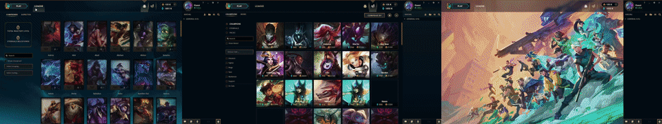
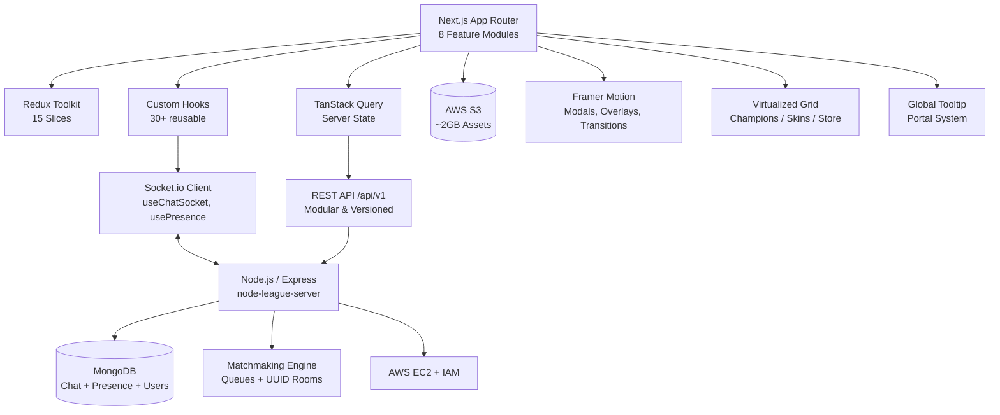

# Next League Client — High-Fidelity LoL Client in Next.js


**Live Demo:** [next-league-client.vercel.app](https://next-league-client.vercel.app) | **Backend:** [node-league-server](https://github.com/JonathanLazarte/node-league-server) | **Stack:** Next.js App Router • Redux Toolkit • TanStack Query • Socket.io • AWS

> Recreation of the League of Legends desktop client focused on frontend architecture, real-time systems and performance — not just UI.

---

### 🎬 Preview





---

### ⚡ Quick Start

```bash
# 1. Clone
git clone https://github.com/JonathanLazarte/next-league-client.git
cd next-league-client

# 2. Env
cp .env.example .env.local
# Set NEXT_PUBLIC_API_URL y SOCKET_URL

# 3. Install & Run
npm install
npm run dev
# → http://localhost:3000
```

---

### 🧠 Why not just another clone?

This is what AI-generated portfolios can't show:

- **185 commits** since Jan 2026, migrated to `strict: true` — **600+ type errors fixed manually**
- **Virtualized grid renders 12 DOM nodes instead of 1.800** → 60fps on mid-range devices, 0 jank on scroll
- **Single global tooltip system** with React Portal, adaptive positioning & hover-intent — not 1 tooltip per item (shared infrastructure used across entire app)
- **Real-time matchmaking** with queues, UUID rooms, presence & persistent chat (MongoDB) — not a fake socket echo
- **2GB of assets** decoupled to S3 + EC2 deployment with IAM — full infra, not just Vercel frontend

---

### 🏗️ Architecture



**Separation of concerns:** Route features (`app/dashboard/...`) vs reusable infrastructure (`src/components/Tooltip`, `VirtualGrid`, `chat`, `modals`). Every complex system is shared, not duplicated.

---

### ✨ Features

**Collection:** Champion + Skin collection with filtering, 1.800+ items virtualized, detail modal with abilities & skins
**Store:** Champion/skin store, reusable cards, purchase flow, shared owned-content state
**Game Modes:** PvP, Co-op vs AI, Map selection (Summoner's Rift / ARAM), Queue & Lobby flow
**Real-Time:** Chat, presence, socket sync, matchmaking state
**UI Systems:** Reusable modal architecture, global tooltips, custom selects, loading overlays, sound management, animations

---

### 🔧 Technical Highlights

**State Management:** Redux Toolkit centralized with 15 slices: auth, chat, connected users, matchmaking, notifications, profile, purchases, settings, sound, store, tooltips, user champions/skins, UI.

**Data Fetching:** TanStack Query for server state. Custom hooks: `useChampions`, `useSkins`, `useAuth`, `useChatSocket`, `useTooltip`, `useHoverIntent`, `useResizeObserver`, `useDebounce`, `useThrottle`, `useSound`.

**Virtualized Rendering:** Reusable grids for champions/skins/store. Reduces DOM nodes, critical for 1.800+ dataset.

**Global Tooltip Infrastructure:** Portal-based rendering, adaptive positioning, hover-intent, trigger layers, arrows, shared state — one system, many variants.

**Real-Time:** Socket.io client encapsulated in hooks, integrated with Redux. Used for chat, presence, status, matchmaking.

**Performance:** Virtualization, debounced/throttled interactions, resize observers, conditional rendering, shared UI systems.

**Animation:** Framer Motion for page transitions, overlays, modals, micro-interactions.

---

### 📁 Project Structure

```
next-league-client/
├── app/
│   ├── auth/login|register/
│   └── dashboard/collection|league|play|store/
├── src/
│   ├── components/ChampionDetailModal|Tooltip|VirtualGrid|chat|cards|header/
│   ├── engine/
│   ├── hooks/ (30+)
│   ├── redux/slices/
│   ├── services/
│   └── utils/
└── public/
```

---

### 🚀 Deployment

- **Client:** Vercel — [next-league-client.vercel.app](https://next-league-client.vercel.app)
- **API:** AWS EC2 (Node/Express)
- **Assets:** AWS S3 (~2GB) + IAM
- **Docker:** Dockerfile included

---

### 🛠️ Tech Stack

| Layer | Tech |
|-------|------|
| Frontend | Next.js 15 (App Router), React 18, TypeScript strict, Tailwind CSS |
| State | Redux Toolkit (15 slices), TanStack Query |
| Real-Time | Socket.io |
| UI | Framer Motion, React Portals, Virtualization |
| Backend | Node.js, Express, MongoDB, Mongoose (separate repo) |
| Cloud | AWS EC2, S3, IAM, Docker, Vercel |
| Tooling | ESLint, Jest (WIP), Git |

---

### 📈 What I'm improving now

- [ ] Jest + React Testing Library — integration tests for matchmaking flow
- [ ] PostgreSQL migration for relational data
- [ ] Lighthouse + Bundle analyzer badges
- [ ] E2E with Playwright for lobby flow

---

### 👤 Author

**Jonathan Lazarte** — Full-Stack Developer | Hurlingham, Buenos Aires
[LinkedIn](https://linkedin.com/in/jonathan-lazarte) • [GitHub](https://github.com/JonathanLazarte) • lazartejonathan10@gmail.com

> Looking for first full-time role as Full-Stack / Frontend focused on real-time systems and performance. Open to remote LATAM / US.

---

### 📄 License

MIT — free to use for learning and portfolio review.
